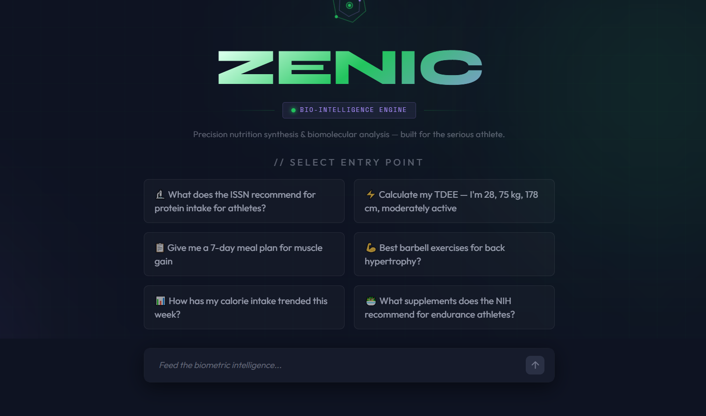

# Zenic — AI Health & Nutrition Assistant

A production-grade AI assistant for health, nutrition, and fitness — built across three engineering pillars: advanced RAG retrieval, agentic orchestration, and automated LLM evaluation.

---

## What It Does

Zenic answers natural language questions about nutrition and exercise using a locally indexed knowledge base, then routes each query through a multi-node LangGraph agent to determine the right response type: a factual answer, a macro calculation, a downloadable meal/workout plan, or a weekly health summary.



**Example interactions:**
- *"What does the ISSN recommend for protein intake for athletes?"* → RAG answer citing source + year
- *"Calculate my TDEE — I'm 28, 75kg, 178cm, moderately active"* → deterministic math, no LLM
- *"Give me a 7-day meal plan for muscle gain"* → structured plan + downloadable PDF
- *"What are the best barbell exercises for hypertrophy?"* → exercise retrieval from wger
- *"How has my calorie intake trended this week?"* → weekly summary with insights

---

## Architecture — Three Pillars

### Pillar 1 — Advanced RAG (`zenic/rag/`)

Multi-stage retrieval pipeline over a 10,201-chunk knowledge base:

```
query → multi-query expansion (Groq, 3 variants)
      → hybrid search (ChromaDB vector + BM25Okapi)
      → per-source diversity cap (max 12 per source)
      → cross-encoder reranking (BAAI/bge-reranker-base)
      → live USDA API fallback (when top rerank score < 0.5)
      → generate (Groq Llama 3.3 70B, strict Librarian prompt)
```

**Key design choices:**
- True hybrid injection: BM25 candidates not in vector results are injected before reranking, preventing terse structured documents (USDA nutrient tables) from being excluded
- Per-source cap prevents NIH ODS (6k+ chunks) from crowding out smaller sources pre-rerank
- RAG-first rule enforced by `rag_vs_api_check.py` — live APIs are fallback only

**Knowledge base — 10,201 chunks:**

| Source | Chunks | Chunking strategy |
|--------|--------|-------------------|
| NIH ODS fact sheets | 6,033 | One chunk per supplement section |
| USDA FoodData Central | 3,000 | One chunk per food item |
| wger exercise database | 897 | One chunk per exercise |
| Dietary Guidelines 2020–25 | 143 | Recursive split, 500–800 tokens |
| ISSN position papers | 148 | Section-aware with metadata prefix |
| Synthetic patches | 3 | Hand-crafted for known retrieval gaps |

### Pillar 2 — Agentic Orchestration (`zenic/agent/`)

A LangGraph `StateGraph` routing 6 intent classes through typed nodes:

```
safety_check → router → profile_check → [intent-specific path] → generate/pdf
```

| Intent | Node sequence |
|--------|--------------|
| `nutrition_qa` | safety → router → rag_retrieval → generate |
| `calculate` | safety → router → profile_check → calculator → generate |
| `meal_plan` | safety → router → profile_check → food_retrieval → plan_compose → pdf_generate |
| `workout_plan` | safety → router → profile_check → exercise_retrieval → plan_compose → pdf_generate |
| `weekly_summary` | safety → router → data_ingestion → trend_analysis → insight_generation → pdf_generate |
| `general_chat` | safety → router → generate |

Every node is a pure function on `ZenicState` (TypedDict). Math nodes (`calculator`, `trend_analysis`) are fully deterministic — no LLM involved.

**Safety system — three layers:**
- Layer 1: regex keyword classifier (pre-LLM, zero latency)
- Layer 2: live OpenFDA adverse event lookup (cached)
- Layer 3: system prompt constraints in `generate()`

### Pillar 3 — Evaluation (`tests/`, `scripts/ragas_eval.py`)

Automated and manual evaluation suite:

| Test type | Coverage | Result |
|-----------|----------|--------|
| Unit tests (no API) | BMR/TDEE math, profile logic, safety classifier | 33/33 PASS |
| Integration tests | Router intent classification (12 cases, 6 classes) | 12/12 PASS |
| Node-sequence tests | LangGraph workflow correctness for all 8 paths | 8/8 PASS |
| RAGAS faithfulness | LLM-as-judge grounding eval (Gemma 4 31B) | **0.722** ❌ (target >0.85) |
| RAGAS context precision | Retrieval relevance (Gemma 4 31B) | **0.716** ❌ (target >0.75) |
| RAG vs API boundary | 6 cases, RAG-first rule enforcement | 6/6 PASS |

---

## Evaluation Results

**Faithfulness** measures whether every claim in the generated answer is grounded in the retrieved context chunks — a score of 1.0 means no hallucination at all. **Context precision** measures how many of the retrieved chunks were actually relevant to the question — higher scores mean the pipeline surfaces the right documents, not just any documents.

Latest scores (7 cases, `--no-multi-query`, judge: Gemma 4 31B IT, 2026-04-19):

| Case | Faithfulness | Context Precision | Notes |
|------|-------------|------------------|-------|
| p1_003 | 1.000 | 0.587 | NIH ODS retrieval noise — answer correct, adjacent vitamin D chunks ranked alongside the UL chunk |
| p1_004 | 0.250 | 0.833 | Regression under investigation |
| p1_006 | 1.000 | 1.000 | |
| p1_007 | 1.000 | 0.593 | |
| p1_009 | 0.929 | 1.000 | |
| p1_011 | 0.875 | 1.000 | |
| p1_012 | 0.000 | 0.000 | Regression under investigation |
| **Average** | **0.722** ❌ | **0.716** ❌ | Below targets (>0.85 / >0.75) |

**Skipped cases:**

**USDA data gap** (`p1_001`, `p1_002`, `p1_010`): The 3k-chunk USDA subset is skewed toward processed foods — plain chicken breast, raw spinach, and banana are not indexed. For these queries the system correctly triggers the live USDA API fallback, validated separately by `rag_vs_api_check.py` (6/6 PASS). The RAGAS eval script calls the retrieval pipeline directly and doesn't run the full LangGraph agent, so the API fallback path is outside its scope.

**Single-query retrieval gap** (`p1_005`): "What are good compound exercises for back using a barbell" requires multi-query expansion to surface the wger Barbell Row chunk — single-query retrieves leg/shoulder exercises instead. Scores correctly (~0.99) with multi-query enabled.

**Judge parsing bug** (`p1_008`): Retrieval score is 0.999 and the generated answer is word-for-word from chunk 1, yet Gemma 4 assigns 0.000 faithfulness. The calcium nutrient table structure confuses the judge's JSON parser — a known LLM-as-judge limitation.

**Scope note:** This eval measures RAG retrieval quality in isolation. A future agent-level eval would run the full LangGraph pipeline and extract contexts from `ZenicState` — covering both the RAG path and the API fallback — giving end-to-end faithfulness scores closer to what users actually experience.

---

## Tech Stack

| Layer | Technology |
|-------|-----------|
| LLM | Groq — Llama 3.3 70B Versatile |
| Embeddings | `BAAI/bge-small-en-v1.5` (SentenceTransformers) |
| Reranker | `BAAI/bge-reranker-base` (CrossEncoder) |
| BM25 | `rank_bm25` (BM25Okapi) |
| Vector store (dev) | ChromaDB |
| Vector store (prod) | Qdrant Cloud |
| Agent framework | LangGraph (StateGraph) |
| UI | Streamlit |
| PDF generation | FPDF2 |
| Evaluation | RAGAS + LangChain Google GenAI |
| Judge LLM | Gemma 4 31B IT (Google AI) |
| Deployment | HF Spaces (Docker runtime, 16 GiB RAM) |
| Container | Podman |

---

## Project Structure

```
zenic/
├── rag/
│   ├── pipeline.py          # Full retrieval pipeline (retrieve, generate, hybrid_search, rerank)
│   ├── vector_store.py      # ChromaDB ↔ Qdrant adapter (ENV-based toggle)
│   └── ingestion/           # Per-source ingest scripts (usda, nih, issn, wger, dietary_guidelines)
├── agent/
│   ├── state.py             # ZenicState TypedDict
│   ├── graph.py             # LangGraph assembly + routing logic
│   ├── nodes/               # Pure node functions (safety_check, router, calculator, pdf_generate …)
│   ├── tools/               # calculations.py (deterministic math), usda_api.py, wger_api.py
│   └── trace.py             # Node-visit recorder for integration tests
├── safety/
│   ├── layer1_classifier.py # Regex keyword filter
│   └── layer2_openfda.py    # OpenFDA adverse event lookup
└── ui/
    ├── app.py               # Streamlit chat interface
    └── styles.css           # Custom CSS (dark theme, metric cards, hero section)

tests/
├── pillar2/                 # test_calculations, test_profile_check, test_router
└── pillar3/                 # test_safety, test_node_sequence

scripts/
├── ragas_eval.py            # Automated RAGAS evaluation
├── faithfulness_spot_check.py
├── rag_vs_api_check.py      # RAG-first boundary verification
├── debug_reranker.py        # Reranker diagnostics (zero LLM calls)
├── check_groq_limit.py      # Pre-run Groq health check
├── check_gemini_limit.py    # Pre-run Gemini health check
└── migrate_to_qdrant.py     # One-time corpus migration to Qdrant Cloud

eval_data/
└── pillar1_spot_check.json  # 12 hand-crafted evaluation cases

.streamlit/
└── config.toml              # Streamlit theme (dark green palette)
```

---

## Setup

```bash
# Clone and install
git clone https://github.com/YOUR_USERNAME/zenic.git
cd zenic
pip install -r requirements.txt

# Configure environment
cp .env.example .env
# Fill in: GROQ_API_KEY, GOOGLE_API_KEY, USDA_API_KEY
# For production: QDRANT_URL, QDRANT_API_KEY, ENV=production

# Run the app (local dev — uses ChromaDB)
streamlit run zenic/ui/app.py

# Run tests (no API keys needed)
pytest -v -m "not integration"

# Run RAGAS evaluation (~25k Groq tokens)
python scripts/check_groq_limit.py
python scripts/check_gemini_limit.py
PYTHONPATH=. python scripts/ragas_eval.py --no-multi-query
```

**Required API keys:**
| Key | Used for |
|-----|---------|
| `GROQ_API_KEY` | All LLM calls (generation + multi-query expansion) |
| `GOOGLE_API_KEY` | RAGAS judge (Gemma 4 31B IT) |
| `USDA_API_KEY` | Live food data fallback |
| `QDRANT_URL` + `QDRANT_API_KEY` | Production vector store |

---

## Deployment (HF Spaces + Podman)

```bash
# Build image (pre-bakes embedding models for fast cold start)
podman build -t zenic .

# Smoke test locally
podman run -p 8501:8501 --env-file .env zenic

# One-time Qdrant Cloud migration
PYTHONPATH=. python scripts/migrate_to_qdrant.py

# Push to HF Spaces
podman tag zenic registry.hf.co/USERNAME/zenic:latest
podman push registry.hf.co/USERNAME/zenic:latest
```

Set HF Spaces secrets: `GROQ_API_KEY`, `QDRANT_URL`, `QDRANT_API_KEY`, `USDA_API_KEY`, `GOOGLE_API_KEY`, `ENV=production`

---

## Key Design Rules

- **RAG-first, API-fallback**: local vector DB always queried first; USDA/wger live APIs called only when rerank score < 0.5
- **Deterministic math, RAG for knowledge**: BMR, TDEE, macro splits are pure Python functions — never delegated to the LLM
- **Source citations non-negotiable**: every generated answer must cite source name and year inline
- **Strict Librarian prompt**: LLM is explicitly forbidden from adding knowledge not present in retrieved chunks
